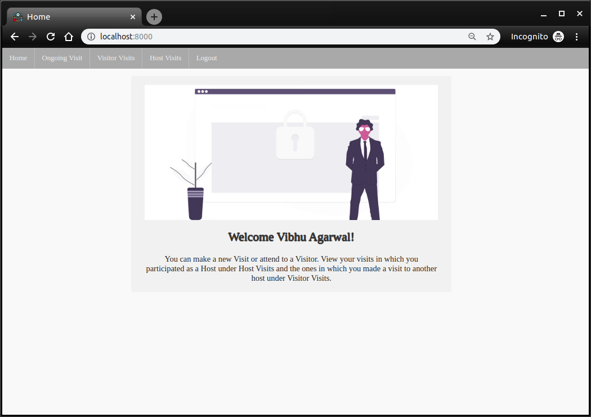

<p align="center">
  
</p>

# Entry Management App

[](https://github.com/Vibhu-Agarwal/Entry_Management_App/issues) [](https://github.com/Vibhu-Agarwal/Entry_Management_App/network/members) [](https://github.com/Vibhu-Agarwal/Entry_Management_App/stargazers)        


## Index

- [Index](#index)
- [About](#about)
  - [Workflow](#workflow)
  - [Tech Stack Used](#tech-stack-used)
  - [SummerGeeks](#summer-geeks)
- [Usage](#usage)
- [File Structure](#file-structure)
- [Gallery](#gallery)
- [Credit/Acknowledgment](#creditacknowledgment)
- [License](#license)

## About

Entry Management App is a web application that can be used at entry-points at several places, partcularly targetting offices where it needs to digitalize their process of maintaining records of visitors and visits. The application keeps the users updated about entry and exit of the visit through text messages and mails.

### Workflow
<p align="center">
  
</p>
The App comprises of three types of Users: Managers, Employees/Hosts and Visitors.

<p align="center">
  
</p>
Managers can create New Hosts by entering their email in the application. The app generates and sends a unique sign-up link to the person [The token used with unique sign-up link is stored as hash using bcrypt in DB].

<p align="center">
  
</p>
Once a host successfully signs up in the application, visitors can select one of the host on New Visit page. Any person except people from management can fill the New Visit form which triggers notifications to Hosts on Check-In.

<p align="center">
  
</p>
The New Visit Form looks for the free slots of the intended Host and indicates error on the New Visit form if tried to book a visit when the host is busy.

Check-out of a visit can be done from both Host and Visitor ends. As soon as the visit is checked out, an email is sent to the Visitor informing about all the details of the Visit.

### Tech Stack Used
The application backed by Django framework and for its back-end and uses SQLite3 as database to store data. It also makes use of Twilio APIs to send SMS to Hosts of the Visit. The front-end of the application is written in HTML and CSS and uses AJAX calls with forms for auto-completion.

### Summer Geeks
The project is made for my submission for the [SummerGeeks 2020](https://summergeeks.in/) challenge.

## Usage

If you just want to do a simple test run of the application, just follow these steps:

- Clone the repository

```bash
$ git clone https://github.com/Vibhu-Agarwal/Entry_Management_App.git
```
- Install dependencies by using the following commands.

```bash
$ cd Entry_Management_App
$ pip install -r requirements.txt
```
```bash
$ cd event_manager
```
- Get credentials and a trial number [Twilio](www.twilio.com/referral/vqcjRB).
- Make sure 2FA is disabled on your mail account and [Less secure app access](https://myaccount.google.com/lesssecureapps) is turned on.

- Edit the values of variables in the `set_env_vars` file and save the changes.
```bash
export EM_EMAIL_HOST_USER="YOUR_(G)MAIL_ID"
export EM_EMAIL_HOST_PASSWORD="YOUR_(G)MAIL_PASSWORD"
export EM_TWILIO_ACCOUNT_SID="YOUR_TWILIO_ACCOUNT_SID"
export EM_TWILIO_AUTH_TOKEN="YOUR_TWILIO_ACCOUNT_AUTH_TOKEN"
export EM_TWILIO_NUMBER="YOUR_TWILIO_SENDER_NUMBER"
```
**NOTE**: If you wish to skip creating TWILIO credentials, set **`ALLOW_SMS`** in **[settings.py](https://github.com/Vibhu-Agarwal/Entry_Management_App/blob/3d050028cca591a5c9f8e2dee71d2fdb02e5ea30/event_manager/event_manager/settings.py#L127)** to **`False`**!
`
- After filling out the correct values of the variables, run this to export them.
```bash
$ source set_env_vars
```

- Apply migrations and set up your initial database.

```bash
$ python manage.py makemigrations
$ python manage.py migrate
$ python manage.py em_setup
```  

- Finally run the application using 

```bash
$ python manage.py runserver
```  

Initial Admin email: `superuser@emweb.in`  
Initial Admin password: Same as `EM_EMAIL_HOST_PASSWORD` value.  
Initial Manager email: **`manageruser@emweb.in`**  
Initial Manager password: Same as `EM_EMAIL_HOST_PASSWORD` value.

## File Structure

```bash
Entry_Management_App/
├── event_manager
│   ├── api
│   │   ├── urls.py
│   │   └── views.py
│   ├── event_manager
│   │   ├── settings.py
│   │   └── urls.py
│   ├── management
│   │   ├── forms.py
│   │   ├── mailing.py
│   │   ├── messaging.py
│   │   ├── migrations
│   │   ├── models.py
│   │   ├── serializers.py
│   │   ├── templates
│   │   ├── urls.py
│   │   └── views.py
│   ├── manage.py
│   ├── media
│   │   └── static
│   ├── set_env_vars
│   ├── static
│   │   └── css
│   ├── templates
│   ├── users
│   │   ├── forms.py
│   │   ├── migrations
│   │   ├── models.py
│   │   ├── permissions.py
│   │   ├── serializers.py
│   │   ├── templates
│   │   ├── urls.py
│   │   └── views.py
│   └── visit
│       ├── forms.py
│       ├── migrations
│       ├── models.py
│       ├── serializers.py
│       └── views.py
├── LICENSE
├── README.md
└── requirements.txt
```


## Gallery

<p align="center">
  
</p>
<p align="center">
  
</p>
<p align="center">
  
</p>
<p align="center">
  
</p>
<p align="center">
  
</p>
<p align="center">
  
</p>


## Credit/Acknowledgment
[](https://github.com/Vibhu-Agarwal/Entry_Management_App/graphs/contributors)

## License
[](https://github.com/Vibhu-Agarwal/Entry_Management_App/blob/master/LICENSE)

## Icons
<a href="https://iconscout.com/icon/meeting-time-1605675" target="_blank">Meeting time Icon</a> by <a href="https://iconscout.com/contributors/iconscout" target="_blank">Iconscout Freebies</a>  
<a href="https://iconscout.com/icon/podium-147" target="_blank">Podium Icon</a> by <a href="https://iconscout.com/contributors/jemismali" target="_blank">Jemis Mali</a>  
<a href="https://iconscout.com/icon/schedule-1543422" target="_blank">Schedule Icon</a> by <a href="https://iconscout.com/contributors/iconscout">Iconscout Freebies</a> on <a href="https://iconscout.com">Iconscout</a>  
<a href="https://iconscout.com/icon/email-1760083" target="_blank">Email Icon</a> by <a href="https://iconscout.com/contributors/promotion-king">Promotion King</a> on <a href="https://iconscout.com">Iconscout</a>
